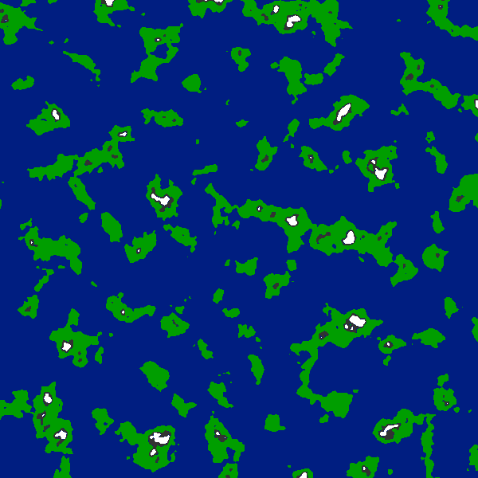
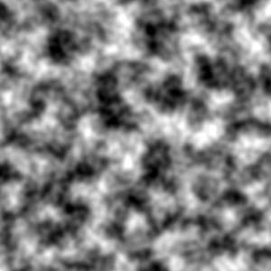

# Map Generator (Prototype)

This project is a prototype for a bigger project I have in mind for the future.

There are three core aspects to the program, colormap.py, NewNoiseMap.py, and window.py.

NewNoisemap.py creates a 2D greyscale noise map, to be used as a height map for generating terrain. NewNoisemap.py uses the Noise library to generate Perlin noise numbers into an array. PIL is then used to create the images using the array generated, creating a greyscale image.

Colormap.py creates different thresholds for the noise map image generated by NewNoiseMap.py in order to create landmasses, with small mountain ranges at it's highest points.

Window.py brings everything together using tkinter as a simple GUI, taking in inputs for NewNoiseMap.py as well as colormap.py.

Now for problems run into that make this a prototype and not a complete project.

Tkinter is limited in how to put in inputs, at least at my level of ability. I'm interested in taking aspects of this project and making it into a web app for people to use for their own terrain generation, specifically for RPG games.

Tiling.py makes a hexagonal grid overlay over an image, scaling to different sizes of hexagons. This isn't finalized and aspects of it would be used in the future possibly, but for this project it was unnecessary to incorporate. Nonetheless I leave it here for late usage.
